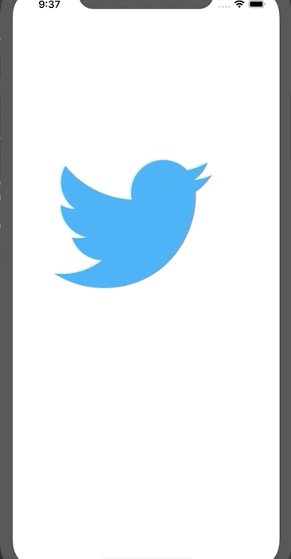

# Twitter Remake

Flix is an app that allows users to browse movies from the [The Movie Database API](http://docs.themoviedb.apiary.io/#).

# Twitter - Part II

This is a basic twitter app to view, compose, favorite, and retweet tweets.

Time spent: **X** hours spent in total

## User Stories

The following **required** functionality is completed:

- [ ] User can compose a tweet. (4pts)
- [ ] User can favorite a tweet. (4pts)
- [ ] User can retweet a tweet. (2pts)

The following **bonus** features are implemented:

- [ ] When composing a tweet, user sees a countdown for the number of characters remaining for the tweet (out of 140) (2pts)
- [ ] User can view their profile in a profile tab. (3pts)
- [ ] User sees embedded images in tweet if available. (3pts)

## Video Walkthrough

Here's a walkthrough of implemented user stories:

---

## Twitter Part I

### User Stories
#### REQUIRED (10pts)
- [X] User sees app icon in home screen and styled launch screen. (2pts)
- [X] User can log in. (1pt)
- [X] User can log out. (1pt)
- [X] User stays logged in across restarts. (1pt)
- [X] User can view tweets with the user profile picture, username, and tweet text. (6pts)

#### BONUS
- [ ] User can pull to refresh. (1pt)
- [ ] User can load past tweets infinitely. (2pts)

### App Walkthough GIF

### Notes
